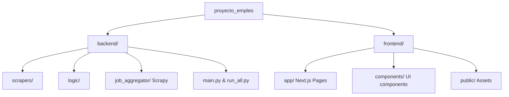
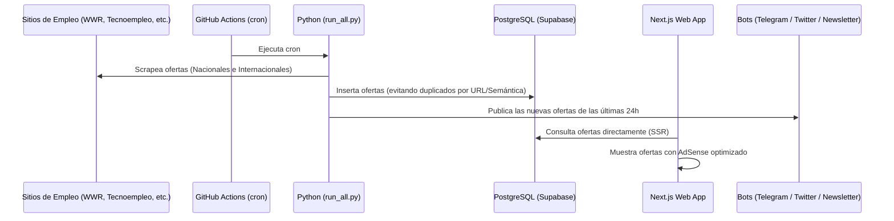

# 📌 Contexto de Desarrollo y Arquitectura - Portal Empleo IT

Este documento sirve como fuente única de verdad para que cualquier modelo de IA (como Gemini/Antigravity) o desarrollador entienda al instante el funcionamiento del portal, su stack tecnológico, flujos de datos activos y estado de deuda técnica.

> [!IMPORTANT]
> **Para el Asistente de IA (Gemini):** Lee este archivo al inicio de cada nueva conversación para obtener todo el contexto del proyecto de forma rápida, precisa y con bajo consumo de tokens.

---

## 🛠️ Stack Tecnológico

El proyecto está dividido en un frontend moderno y un backend automatizado de ingesta de datos:

| Componente | Tecnología | Detalles / Configuración |
| :--- | :--- | :--- |
| **Frontend** | **Next.js 15 (App Router)** | TypeScript, Tailwind CSS v4, React 19. Desplegado en Vercel. |
| **Backend** | **Python 3.x** | FastAPI (servicios/bots), psycopg2, Scrapy (arañas), cloudscraper, beautifulsoup4. |
| **Base de Datos** | **PostgreSQL** | Hospedado en Supabase. Conexión directa en producción. |
| **Automatización** | **GitHub Actions** | Tareas programadas (cron) para scrapers y envíos. |
| **Canales Externos** | **Telegram, Twitter/X, Email** | Integraciones de bots para difusión automática de ofertas. |

---

## 📂 Estructura del Proyecto

A grandes rasgos, el repositorio se organiza de la siguiente manera:

*   **`backend/`**: Código en Python para la obtención de ofertas de empleo.
    *   `main.py`: Ejecuta la cola de scrapers internacionales (`scrapers/` de WeWorkRemotely, Remotive, etc.).
    *   `run_all.py`: Orquestador principal que ejecuta todos los scrapers (locales e internacionales) y el bot de Telegram.
    *   `scraper_spain.py` y `scraper_infoempleo.py`: Scrapers dedicados para España.
    *   `telegram_bot.py` y `twitter_bot.py`: Bots para publicar las ofertas automáticamente.
    *   `mailer.py`: Gestor de boletines / newsletters para suscriptores.
*   **`frontend/`**: Aplicación web SPA/SSR en Next.js.
    *   `app/page.tsx`: Vista principal de listado de trabajos usando conexión directa de Postgres.
    *   `app/job/[id]/page.tsx`: Detalle de la oferta de empleo (ruta canónica oficial).
    *   `app/trabajos/[sector]/page.tsx`: Páginas dinámicas por categoría (usan Supabase SDK).
    *   `app/privacy/page.tsx` y `app/cookies/page.tsx`: Páginas legales.

---

## 🔄 Flujo de Trabajo y Datos Activos

El siguiente diagrama muestra cómo fluyen los datos desde las fuentes de empleo externas hasta el usuario final:

---

## 🚨 Deuda Técnica y Limpieza (Archivo de Referencia: `analisis_archivos_obsoletos.md`)

Actualmente existen componentes obsoletos y problemas de duplicidad que estamos resolviendo:

### 1. Inconsistencia de Clientes de Base de Datos
*   **Problema**: Algunas páginas del frontend usan la librería `pg` (PostgreSQL directo) y otras el SDK de Supabase (`@supabase/supabase-js`).
*   **Acción recomendada**: Unificar el acceso de datos en el frontend utilizando siempre la conexión directa por Postgres (`pg`) o consolidar las variables de entorno.

### 2. Archivos Obsoletos a Eliminar
Consulte [analisis_archivos_obsoletos.md](file:///home/raul/proyecto_empleo/analisis_archivos_obsoletos.md) para ver la lista completa. Los más importantes son:
*   `src/scraper.py` (antiguo scraper con Supabase SDK).
*   `frontend/app/oferta/[id]/page.tsx` (duplica la ruta oficial `/job/[id]`).
*   `frontend/app/privacidad/page.tsx` (duplica `/privacy`).
*   Workflows de GitHub Actions duplicados (`update_jobs.yml`, `daily_scrape.yml`, etc.).

---

## 🎯 Objetivos de Negocio Activos (Maximización de AdSense y Tráfico)

Cuando realices modificaciones en el código, ten en cuenta las siguientes prioridades:

1.  **SEO (Optimización de Motores de Búsqueda)**:
    *   Mantener las páginas dinámicas `/job/[id]` indexables y con tiempos de carga rápidos.
    *   Asegurar que el `sitemap.ts` liste correctamente todas las ofertas activas.
    *   Evitar redirecciones y mantener la estructura de URLs canónica `/job/[id]`.
2.  **Monetización con AdSense**:
    *   Los bloques de anuncios deben cargarse eficientemente usando `@next/third-parties/google` para no penalizar la velocidad de carga.
    *   Mantener los anuncios visibles pero sin arruinar la experiencia del usuario (lo cual reduce el rebote).
3.  **Adquisición de Tráfico**:
    *   Asegurar que el boletín (newsletter) funcione y capte correos en el frontend (`SubscribeForm.tsx`).
    *   Verificar que las publicaciones automáticas en canales como Telegram sigan captando clics cualificados hacia el portal.
