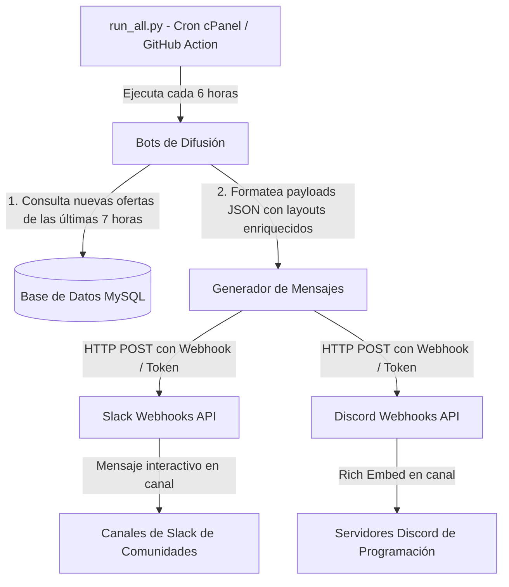

# Hoja de Ruta de Integración: Bots de Slack y Discord (Portal Trabajo IT)

Esta documentación técnica describe la arquitectura, diseño de payloads, flujo de datos e implementación paso a paso para la difusión automatizada de ofertas de empleo tecnológico en canales de Slack y servidores de Discord, extendiendo el sistema existente de bots de Telegram y Twitter.

---

## 📐 1. Arquitectura General y Flujo de Ingesta

El flujo de envío de ofertas a canales de chat externos sigue una arquitectura push desacoplada que se activa periódicamente dentro de la tubería principal de automatización.



---

## 💬 2. Especificación de la Integración con Slack

Para Slack se utilizarán **Incoming Webhooks** o una **Slack App** dedicada para publicar en canales públicos/privados de comunidades de desarrollo de software.

### A. Estructura del Payload (Block Kit)
Slack permite estructurar mensajes interactivos usando su framework visual **Block Kit**. Esto garantiza una visualización excelente en dispositivos móviles y de escritorio.

```json
{
  "blocks": [
    {
      "type": "header",
      "text": {
        "type": "plain_text",
        "text": "🚀 ¡Nuevas ofertas de empleo IT en España!",
        "emoji": true
      }
    },
    {
      "type": "section",
      "text": {
        "type": "mrkdwn",
        "text": "*Senior Backend Developer (Go / Kubernetes)* en *Stark Industries*\n📍 Remoto (España) | 💰 60.000€ - 75.000€"
      }
    },
    {
      "type": "context",
      "elements": [
        {
          "type": "plain_text",
          "text": "📅 Publicado hoy · Categoría: Cloud & DevOps",
          "emoji": true
        }
      ]
    },
    {
      "type": "actions",
      "elements": [
        {
          "type": "button",
          "text": {
            "type": "plain_text",
            "text": "Ver y Postularse 🔗"
          },
          "style": "primary",
          "url": "https://portalempleoit.com/job/senior-backend-developer-go-kubernetes-stark-industries?utm_source=slack&utm_medium=social"
        }
      ]
    },
    {
      "type": "divider"
    }
  ]
}
```

---

## 🎮 3. Especificación de la Integración con Discord

Para Discord se utilizarán **Webhooks de Canal** nativos por su sencillez y rendimiento, sin necesidad de mantener un proceso daemon (bot socket activo).

### A. Estructura del Payload (Rich Embeds)
El payload para Discord utilizará la propiedad `embeds` para dar un acabado gráfico premium con bordes de color personalizados según la categoría de la vacante (ej. verde para Backend, azul para Frontend).

```json
{
  "username": "Portal Trabajo IT",
  "avatar_url": "https://portalempleoit.com/logo.png",
  "embeds": [
    {
      "title": "React Frontend Developer (Teletrabajo 100%)",
      "description": "Buscamos un desarrollador frontend con al menos 2 años de experiencia en React, TypeScript y Tailwind CSS.",
      "url": "https://portalempleoit.com/job/react-frontend-developer?utm_source=discord&utm_medium=social",
      "color": 5198940,
      "fields": [
        {
          "name": "🏢 Empresa",
          "value": "Acme Corp",
          "inline": true
        },
        {
          "name": "📍 Ubicación",
          "value": "Madrid / Remoto",
          "inline": true
        },
        {
          "name": "💰 Salario",
          "value": "35.000€ - 42.000€ brutos/año",
          "inline": true
        }
      ],
      "footer": {
        "text": "Portal Trabajo IT · Ofertas actualizadas cada 6h",
        "icon_url": "https://portalempleoit.com/favicon.ico"
      },
      "timestamp": "2026-06-18T16:40:00Z"
    }
  ]
}
```

---

## 🛠️ 4. Hoja de Ruta de Implementación de Código (Python)

### Paso 1: Configurar Variables de Entorno en el Servidor
Añadir a `backend/.env` las URLs de webhooks necesarias para cada destino o categoría:
```env
SLACK_WEBHOOK_GENERAL=https://example.com/services/T00000000/B00000000/XXXXXXXXXXXXXXXXXXXXXXXX
DISCORD_WEBHOOK_GENERAL=https://example.com/api/webhooks/000000000000000000/XXXXXXXXXXXXXXXXXXXXXXXXXXXXXXXX
```

### Paso 2: Crear Scripts Especializados
1.  **`backend/slack_bot.py`**:
    *   Cargar el webhook desde `.env`.
    *   Consultar la base de datos para recuperar vacantes activas de las últimas 7 horas.
    *   Formatear las ofertas en bloques de Slack.
    *   Enviar un único POST HTTP consolidador a Slack.
2.  **`backend/discord_bot.py`**:
    *   Implementar una lógica idéntica, empaquetando hasta 10 ofertas en un array de `embeds` (límite máximo permitido por payload en Discord).

### Paso 3: Integrar en el Orquestador Maestro
Modificar [run_all.py](file:///home/raul/proyecto_empleo/backend/run_all.py) para incorporar los nuevos bots en la tubería de automatización (fases de ejecución del bot de difusión):

```python
# En backend/run_all.py, agregar la importación o ejecución de procesos:
ejecutar_script("slack_bot.py")
ejecutar_script("discord_bot.py")
```

---

## 📈 5. Beneficios de Crecimiento Orgánico (Growth Loop)

La inclusión de bots en Slack y Discord alimenta un bucle de crecimiento de adquisición sin costes publicitarios:

1.  **Tráfico Calificado**: Los canales de Slack y servidores de Discord de desarrollo de software concentran exactamente el público objetivo del portal.
2.  **Viralidad**: Compartir la oferta con un solo clic dentro del servidor/canal permite un mayor alcance que otros canales.
3.  **Conversión a Referidos**: Al aterrizar en la oferta con la URL etiquetada (`utm_source=slack` o `utm_source=discord`), se le presenta el `ReferralWidget` en la barra lateral del portal, invitándole a suscribirse y compartir su propio enlace con sus compañeros.
